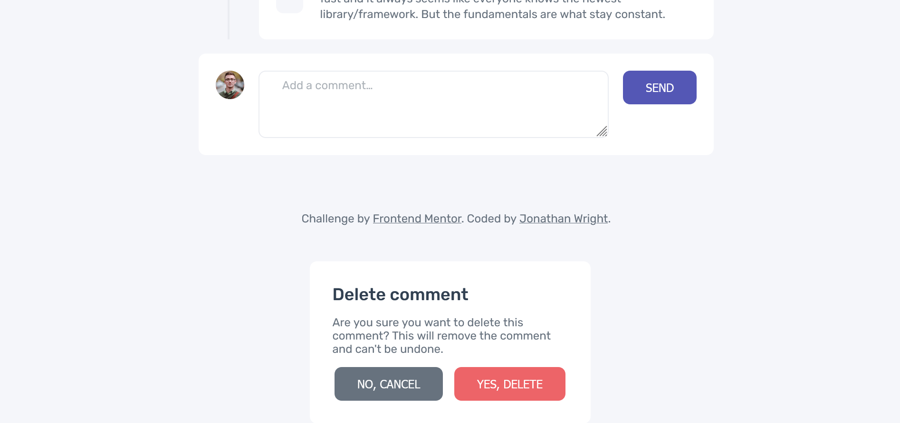
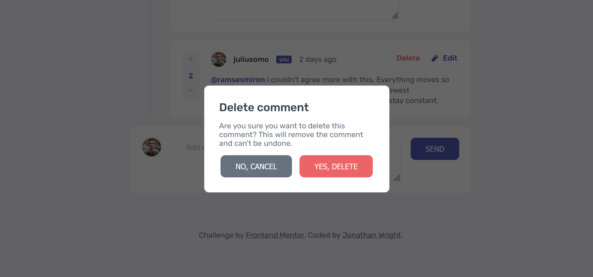
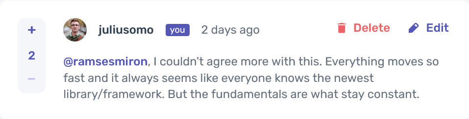

# Frontend Mentor - Interactive comments section solution

This is a solution to the [Interactive comments section challenge on Frontend Mentor](https://www.frontendmentor.io/challenges/interactive-comments-section-iG1RugEG9). Frontend Mentor challenges help you improve your coding skills by building realistic projects. 

## Table of contents

- [Overview](#overview)
  - [The challenge](#the-challenge)
  - [Screenshot](#screenshot)
  - [Links](#links)
- [My process](#my-process)
  - [Built with](#built-with)
  - [What I learned](#what-i-learned)
  - [Useful resources](#useful-resources)
- [Author](#author)

**Note: Delete this note and update the table of contents based on what sections you keep.**

## Overview

### The challenge

Users should be able to:

- View the optimal layout for the app depending on their device's screen size
- See hover states for all interactive elements on the page
- Create, Read, Update, and Delete comments and replies
- Upvote and downvote comments
- **Bonus**: If you're building a purely front-end project, use `localStorage` to save the current state in the browser that persists when the browser is refreshed.
- **Bonus**: Instead of using the `createdAt` strings from the `data.json` file, try using timestamps and dynamically track the time since the comment or reply was posted.

### Screenshot


Add a screenshot of your solution. The easiest way to do this is to use Firefox to view your project, right-click the page and select "Take a Screenshot". You can choose either a full-height screenshot or a cropped one based on how long the page is. If it's very long, it might be best to crop it.

Alternatively, you can use a tool like [FireShot](https://getfireshot.com/) to take the screenshot. FireShot has a free option, so you don't need to purchase it. 

Then crop/optimize/edit your image however you like, add it to your project, and update the file path in the image above.

**Note: Delete this note and the paragraphs above when you add your screenshot. If you prefer not to add a screenshot, feel free to remove this entire section.**

### Links

- Solution URL: [Add solution URL here](https://your-solution-url.com)
- Live Site URL: [Add live site URL here](https://your-live-site-url.com)

## My process

### Built with

- Semantic HTML5 markup
- [Webpack](https://webpack.js.org/) - Static Module Bundler
- SCSS
- Flexbox
- CSS Grid
- Desktop-first workflow
- Imported JSON data

### What I learned<br><br>

1. The first challenge I encountered was working with the html element 'dialog' for the first time. I wanted to use this element due to some of the built in functionality, but it had some unexpected (and perhaps unintended behavior).
<br><br>
The first issue I had was with the margin and padding for the ::backdrop pseudo class. I had set the margin and padding to all elements to 0:
<br><br>
    ```css
    * {
      margin: 0;
      padding: 0;
    }
    ```
    <br>This caused the margin and padding of the backdrop to not cover the entire viewport. I fixed this by excluding the dialog element from that selector using :not():<br><br>

    ```css
    *:not(dialog) {
      margin: 0;
      padding: 0;
    }
    ```

1. The second issue I encountered is that the dialog would be displayed in the document flow (not in front of the other elements) when the page loaded. 
<br><br>

<br><br>
This is not the intended behavior that I understand dialog to have. It should be hidden by default, then pop up above the document when showModal() is executed (assuming that you haven't specified an open state in the HTML). Instead, it was showing up on the page as though it were any other div. The showModal() method still made the modal show up above the viewport, as expected:
<br><br>

<br><br>
The issue, IK found, was CSS styling I had added to the dialog box. When I removed `display: flex`, the behavior returned to normal.
In it's default non-active state, the dialog element should have a box model property of `display: none`. Adding `display: flex` in CSS will give it a box model property of `display: block`. This change makes the dialog element visible when it is in a non-active state.
<br>
1. I later ran into some issues dynamically loading the replies to top level comments to the DOM. I was trying to add them as a sibling to the comment at the same time that I was adding the comment. I was finding that to be a challenge. The approach I took was to wait for all comments to be added, loop through them a second time and find the related replies and add them in a second stage. I don't believe this would be the most performative, and would not scale well, but it seemed to be a decent solution for the size of this project.<br>
1. Once I had my replies loading correctly, I wanted to test the event listener that I had on my delete buttons, to ensure the modal was still responding. Spoiler alert: it was not working.
<br><br>
The event listener I placed on the buttons was not recognizing them because they were loading dynamically. The solution was to add an event listener to the `<main>` element, then use event bubbling to target the desired elements. More event bubbling issues came up when targeting button groups. I resolved those issues using the `e.target.closest()` method, to find the common parent to any desired element.

    ```js
    function editResponse (e) {
    const parent = e.target.closest('.edit')
    
    // Validates that click event was on an edit button group. Quit function if false
    if (!parent) {
        return
    }
    ```
    The `.closest()` function then became a new tool in my toolkit, as a better way of finding parent or ancestor elements.
1. One of the features that I added to comment replies is that when the user clicks on the 'Reply' button group, the original commenter's username is automatically added to the textarea. Looking at the design files, I saw that after the reply is submitted, the callout text (e.g. @username) is formatted in a heavier weight with a darker blue color.<br><br>
<br><br>
  However, I didn't want to restrict this formatting to the beginning of the reply only. I realized that in order to dynamically change the format of any user callout, I would need to wrap all callouts in a span after the comment has been submitted.<br><br>
  In order to dynamically find all callouts after submission, I bit the bullet and finally studied up on **regular expressions**. I knew I needed to be able to find a string that began with the '@' symbol, but only at the beginning of the string, otherwise I would end up reformatting email address as well. After some study and trial and error, I wrote this regex:
    ```js
    // Declare regular expression
    const regex = /(^@\w+|[^(a-zA-Z\d)]@\w+)/gi;

    // Build an array from all regular expressions found
    let arr = [str.match(regex)]
  
    // Loop through each comment
    arr.forEach((comments) => {
      
      //Validate that the comment has a regular expression, if not then return
      if (!comments) {
        return null
      }
      
      // Loop through each regex in the comment, wrap it in a span, then update the string
      comments = comments.forEach(callout => {
        if (callout.length > 0) {
          str = str.replace(callout, `<span class="callout">${callout}</span>`)
        }
      })

    });
    const regex = /(^@\w+|[^(a-zA-Z\d)]@\w+)/gi;
    
    // Return the string to the requesting function 
    return str
    ```
    After all matching expressions are found and added to an array, 
    - I loop through all expressions in the given string
    - Wrap the expression in a span
    - Update the original string
    - Return the string to the function that is building the html template.<br><br>

    One potential issue that I foresaw, but chose not to address, is the issue of any regular expressions that do not match a username (e.g. I'll be there **@5pm**.). I could have compared the list of usernames to the expression value. If the value did not match any username, then the formatting would not be applied. I skipped it, but wanted to address that as a known issue.

### Useful resources

- [TypeOfNaN - Dynamic Event Listeners](https://typeofnan.dev/how-to-bind-event-listeners-on-dynamically-created-elements-in-javascript/) - This helped me understand event listening for dynamically generated elements.
- [Stack Overflow - Event Bubbling](https://stackoverflow.com/a/59424604/13604562) - This Stack Overflow comment helped me understand how to target a parent or grandparent element when any of its descendants are clicked.

# Author

- Website - [Jonathan Wright](https://dr-wrong-mo.github.io/)
- Frontend Mentor - [@Dr-Wrong-Mo](https://www.frontendmentor.io/profile/Dr-Wrong-Mo)